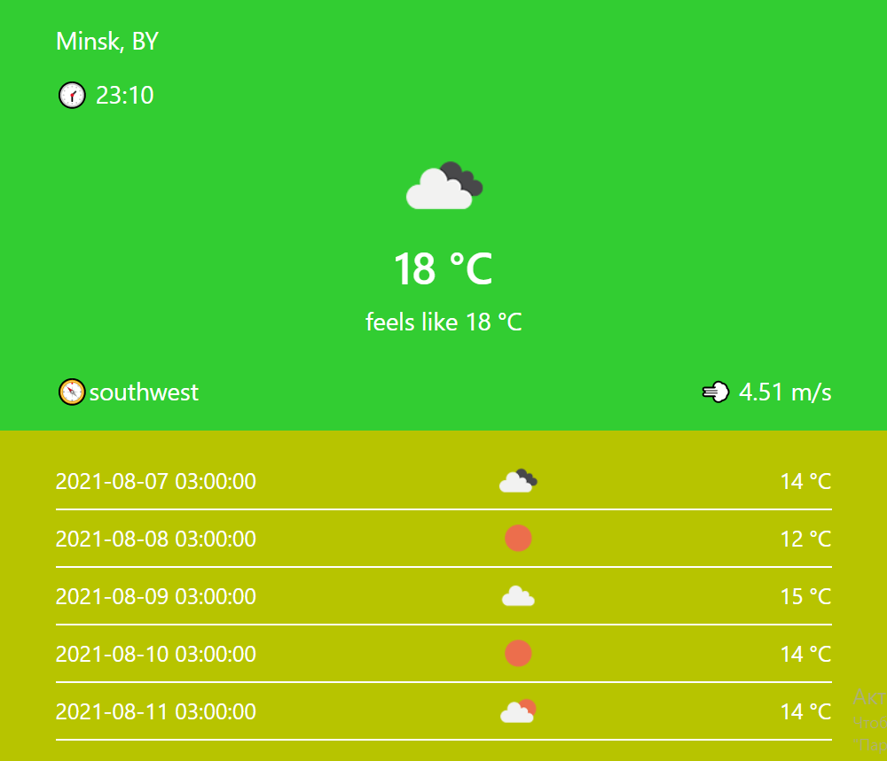

# openweather
## Погодный виджет на основе открытого API - https://openweathermap.org

1. `git clone https://github.com/AntonBoreiko/openweather.git`
2. `cd ./openweather`
3. `npm install`
4. `npm run dev `

